# 配送大师界面介绍（初稿）
整理人：桑鸿庆 
时 间：2015年8月30日
——————————————————————————————————————————————————————————————
## 1.登录与注册界面
### 1.1注册界面
打开配送大师App计进入到如图1-1的登录与注册界面，点击注册界面后出现图1-2界面进行注册，其中信息包括：账号、密码和手机号等信息。注册确定后，信息储存在后台数据库中。
### 1.2登录界面
点击图1-1的登录按钮，出现图1-3界面，参与者输入账号密码，如果后台数据库中的信息匹配，则登录成功，反之登录失败。

 
 `1-1登录与注册界面` 

 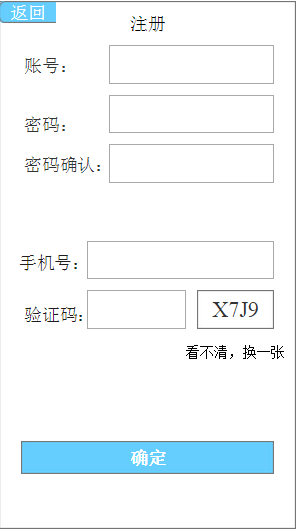
 
 `1-2注册界面` 

  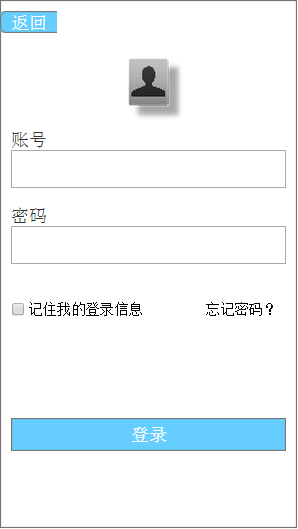
 
 `1-3注册界面` 

##2.参与者进入界面
登录后进入如图2-1等待界面，全部准备完毕后，进入游戏。

   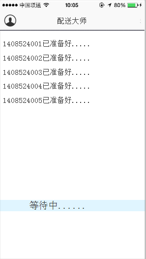
 
 `2-1参与者等待界面` 

##  3.抢单界面
系统从数据库中根据地图随机选跟参与者人数相对应的订单数，如果参与者抢到订单达到数量开始配送 如图3-1。
  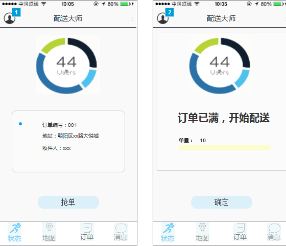
 
 `3-1抢单界面` 

##4.掉线界面
如果有玩家中途电线，将停止所有游戏中的所有动作，重新连接后，回归正常。如图4-1.
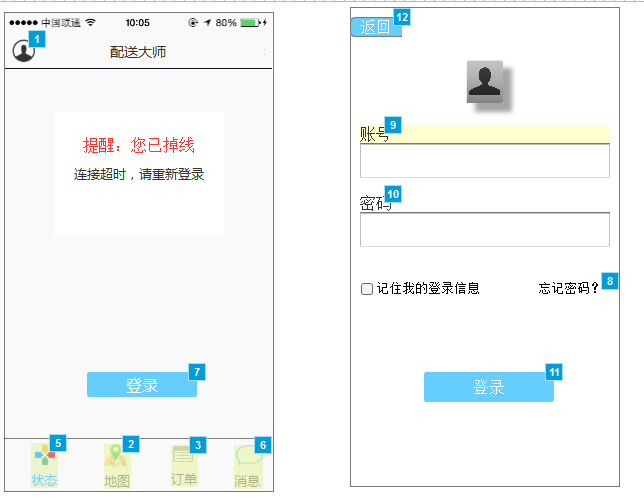
 
 `4-1电线界面` 

## 5.个人中心界面
点击右上角头像显示个人中心，内容包括我的历史排名和登录账户的信息和设置。
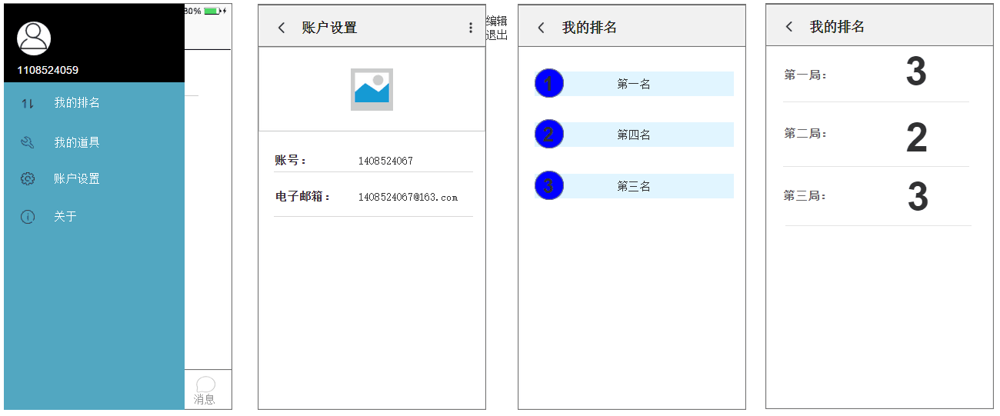
 
 `5-1个人中心界面` 

##6.订单界面
订单界面显示订单的数量、收益等级、地址、编号、已签收订单的数量和状态。
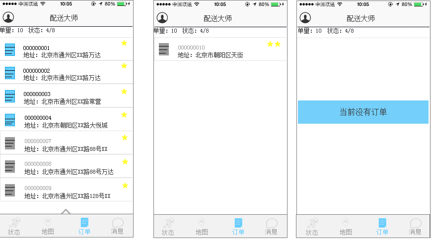
 
 `6-1订单界面` 

##7.状态界面
状态界面显示游戏时间（从抢单环节开始计时）、订单签收、出发、停止、速度、配送的动画，配送完成后显示排名和时间，并将游戏数据记录在个人中心历史记录。
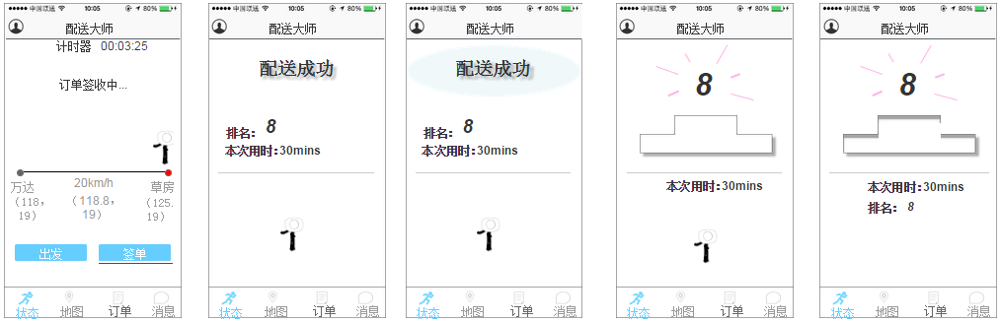
 
 `7-1状态界面` 

 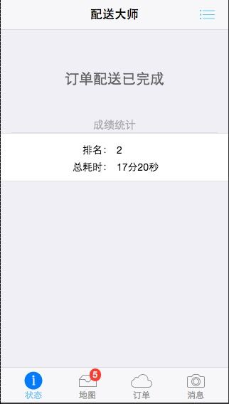
 
 `7-2配送完成` 

##  8.地图界面
显示参与者所有订单的位置，可进行选择查看指定点和去指定目标点。
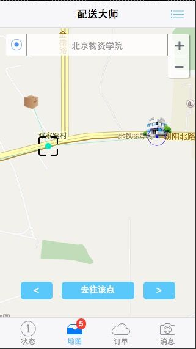
 
 `8-1状态界面` 

## 9.消息界面
显示系统发来的路况、订单签收、状态变化等消息。
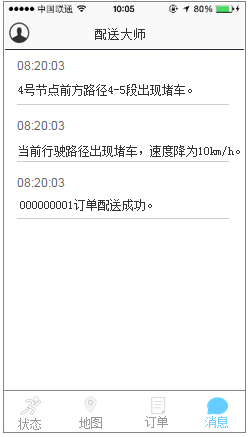
 
 `9-1消息界面` 

##8.配送界面的对应关系与主要流程
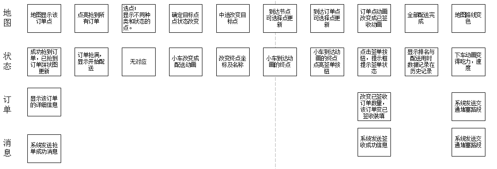
 
 `8-1状态界面` 

 
